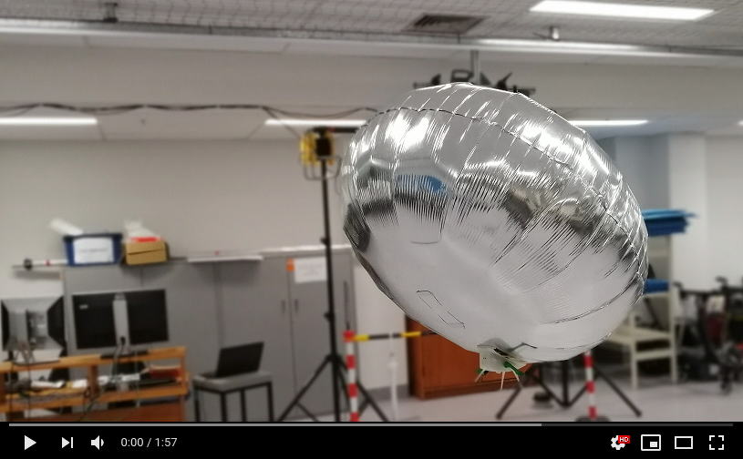

# A Low-Cost, Open-Source, Robotic Airship for Education and Research

Miniature indoor robotic airship platforms offer high mobility, safety, and extended flight times. The work focuses on the feasibility, design, development, and evaluation of such a platform for robotics education and research. Selected commercially available envelope materials were considered and tested in terms of their helium retention capability. The obtained envelope properties were used in a feasibility study, demonstrating that indoor airships are environmentally and financially viable, given an appropriate material choice. The platform's mechanical design was studied in terms of gondola placement and rotor angle positioning, resulting in an unconventional, asymmetric arrangement. The developed system was finally tested in a simple path following experiment for proof-of-concept purposes, proving its efficiency in attaining the desired heading and altitude configuration. The proposed robotic airship platform can be used for a variety of education and research oriented applications and its design is open-source facilitating replication by others.

## Repository Contents
This repository contains the following material:
* Assembly guide and bill of materials
* CAD files of the airship platform
* ROS interface for flight control and path following

## Gondola Design
The airship gondola is built around the electronic components and actuators listed in the provided bill of materials.
The central control and communication unit is a Raspberry Pi Zero W running a Lite version of the Raspbian Stretch operating system. 
Peripheral components include a single cell 500 mAh Li-Ion battery, step-up voltage regulator, motor drivers, three 7x16 mm DC motors, three 57x20 mm propeller units and a camera module that will facilitate the formulation of HRI frameworks.
Rotor speeds can either be controlled by on-board logic or manually via a wireless connection through SSH or an appropriately developed Robot Operating System (ROS) package.
The combined cost of the gondola components (excluding the 3D printing filament and wiring) comes to 90 USD, which drops to 54 USD if the camera module is not required.
The physical frame is 3D printed and built in a modular fashion: the gondola legs and rotor brackets are detachable to facilitate component modification and replacement.
The gondola is attached to the chosen envelope using Velcro.
The assembled gondola and its exploded view model are presented below:

  
  

## Envelope Material
A number of envelope material candidates were examined with respect to their helium permeability and mechanical properties:
* Qualatex untreated round 41 cm (16 inch) latex balloon
* Qualatex untreated round 61 cm (24 inch) latex balloon
* Qualatex round 61 cm (24 inch) latex balloon treated with Ultra Hi-Float (UHF) \cite{HiFloatPatent}
* Qualatex 61 cm (24 inch) clear Bubble balloon (layered membrane including a high barrier layer of ethylene vinyl alcohol copolymer)
* Qualatex round 91 cm (36 inch) Microfoil (metallised PET) balloon

  

The daily helium flux through balloon membranes was computed:

  

The average helium flux values and yearly refill costs for different envelope materials:

  

The measured mechanical properties of latex, Microfoil and Bubble membranes:

  

## Path Following
The airship was evaluated in terms of its path following ability in an indoor environment.
Path following was implemented using a discrete variation of the carrot-chasing algorithm, where the desired path is segmented into a sequence of waypoints.
In a given location, the airship identifies its position with respect to desired path and directs itself towards an appropriate waypoint:

  

